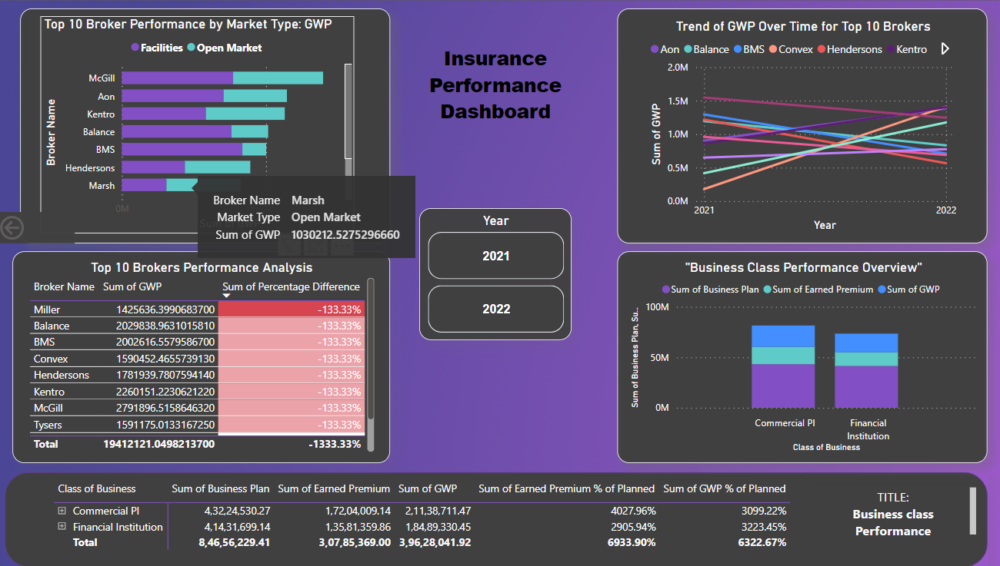

# Insurance Performance Dashboard

Welcome to the Insurance Performance Dashboard! This PowerBI project is designed to provide insightful analysis and visualization of insurance performance data. Whether you're a broker, analyst, or decision-maker in the insurance industry, this dashboard is your go-to tool for understanding key metrics and trends.

## Features

### 1. Top 10 Brokers Tables
- Compare broker performance based on Gross Written Premium (GWP) across different market types.
- Interactive tables with conditional formatting for easy performance assessment.
- New column highlights the percentage difference between actual and planned GWP, making it simple to identify deviations from targets.

### 2. Graphical Representations
- Visualize GWP data across various market types through engaging graphs.
- Bar charts, pie charts, and more provide a comprehensive view of performance trends.
- Dive deeper into data insights with interactive visualizations.

### 3. Business Class Analysis
- Analyze planned premium, earned premium, and GWP for different business classes.
- Drill-down feature allows exploration of class types within each class of business.
- Percentage metrics enable easy comparison and assessment of performance against planned premium.

## Technologies Used
- **PowerBI:** For creating interactive and visually appealing dashboards.
- **Microsoft Excel:** Used for data preprocessing and preparation.

## Usage Instructions
1. **Clone Repository:** Clone this repository to your local machine.
2. **Open PowerBI File:** Open the provided PowerBI file (`Insurance_Performance_Dashboard.pbix`) using PowerBI Desktop.
3. **Explore the Dashboard:** Interact with the dashboard to explore key metrics and visualizations.
4. **Use Filters:** Utilize the filter functionality to select desired years and market types for analysis.

## Future Enhancements
- Incorporate additional data sources to enrich analysis.
- Enhance interactivity and user experience for seamless navigation and exploration.

## Feedback and Contributions
Your feedback is valuable! If you have suggestions for improvements or would like to contribute to this project, feel free to reach out or submit a pull request.

Happy analyzing!

---

*This project is maintained by [Prashanth Mogulagani].
